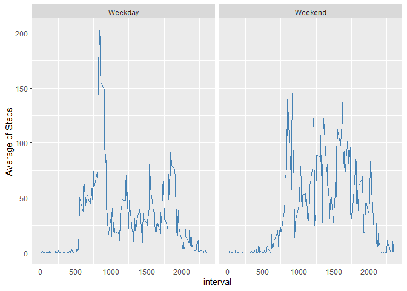

## Loading and preprocessing the data
Our data set is in a csv format file. We will print the first 5 records after the reading and the right formatting of our variables.

```r
activity = read.csv("activity.csv")
activity$date = as.Date(activity$date, "%Y-%m-%d")
head(activity, 5)
```

```
##   steps       date interval
## 1    NA 2012-10-01        0
## 2    NA 2012-10-01        5
## 3    NA 2012-10-01       10
## 4    NA 2012-10-01       15
## 5    NA 2012-10-01       20
```

## What is mean total number of steps taken per day?
Building an histogram where is detailed the quantity of steps taken each day.

```r
data_graph = activity %>% group_by(date) %>% summarise(total.steps = sum(steps, na.rm = T))
ggplot(data_graph, aes(date)) +
  geom_histogram(aes(y = total.steps), stat = "identity", fill = "skyblue") +
  theme_bw() + labs(title = "Total Steps per Day", x = "Date", y = "Number of Steps")
```

```
## Warning: Ignoring unknown parameters: binwidth, bins, pad
```

<!-- -->

Calculating the mean and median of the total of steps per day.

```r
mtc = data.frame(Mean = mean(data_graph$total.steps), Median = median(data_graph$total.steps))
mtc
```

```
##      Mean Median
## 1 9354.23  10395
```


## What is the average daily activity pattern?
We build a time-series plot with the averages of the steps done in each intercept to find a possible pattern

```r
activity %>% group_by(interval) %>% summarise(avg = mean(steps, na.rm = T)) %>%
  ggplot(aes(interval, avg)) + geom_path(color = "steelblue")
```

<!-- -->

```r
activity %>% arrange(desc(steps)) %>% head(., 1)
```

```
##   steps       date interval
## 1   806 2012-11-27      615
```

## Imputing missing values
Here we have a table with the quantity of rows wth missing values

```r
activity %>% summarise(steps.NA = sum(is.na(steps)), date.NA = sum(is.na(date)), 
                       interval.NA = sum(is.na(interval)))
```

```
##   steps.NA date.NA interval.NA
## 1     2304       0           0
```

Given that we are measuring the steps on intervals of 5 minutes there is the possibility that the subject of study have not moved in the whole interval. Therefore the correct value to assume for the missing observations in the steps feature is zero.

```r
activity_full = activity %>% mutate(steps = coalesce(steps, 0))
head(activity_full)
```

```
##   steps       date interval
## 1     0 2012-10-01        0
## 2     0 2012-10-01        5
## 3     0 2012-10-01       10
## 4     0 2012-10-01       15
## 5     0 2012-10-01       20
## 6     0 2012-10-01       25
```

Now we calculate the mean, median and total of steps given each day and plot the respective histogram.

```r
data_graph_full = activity_full %>% group_by(date) %>% summarise(total.steps = sum(steps))
ggplot(data_graph_full, aes(date)) +
  geom_histogram(aes(y = total.steps), stat = "identity", fill = "skyblue") +
  theme_bw() + labs(title = "Total Steps per Day", x = "Date", y = "Number of Steps")
```

```
## Warning: Ignoring unknown parameters: binwidth, bins, pad
```

<!-- -->

```r
data.frame(Mean = mean(data_graph_full$total.steps), Median = median(data_graph_full$total.steps))
```

```
##      Mean Median
## 1 9354.23  10395
```

As we can see there is no variation in the mean nor the median of the quantity of steps done per day.


## Are there differences in activity patterns between weekdays and weekends?
First we categorize the type of day (weekday or weekend) that we have in the data set

```r
activity_day = activity_full %>% 
  mutate(day = weekdays(date), week = ifelse(day == "Saturday" | day == "Sunday", "Weekend", "Weekday")) %>%
  group_by(interval, week) %>% summarise(avg = mean(steps))
ggplot(activity_day, aes(interval, avg)) + geom_path(color = "Steelblue") + facet_wrap(week ~ .) +
  labs(y = "Average of Steps")
```

<!-- -->
